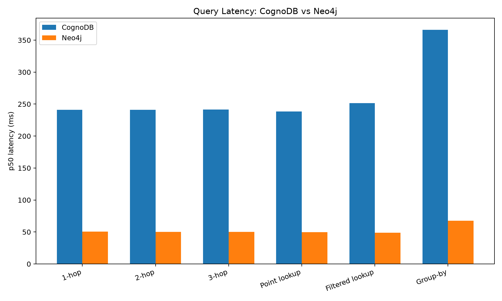
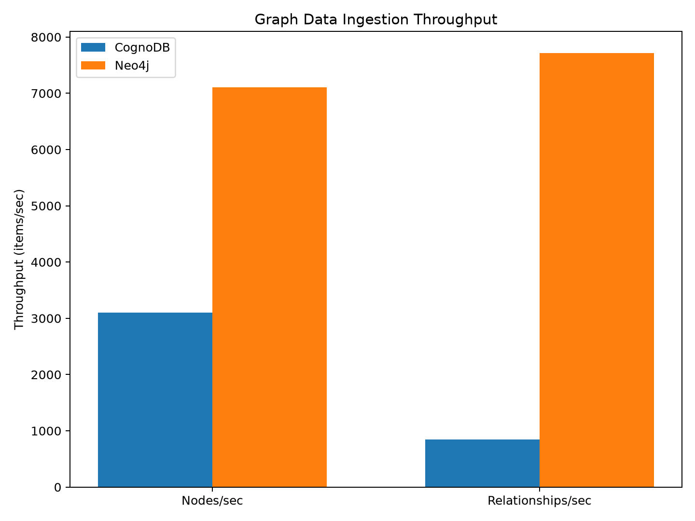
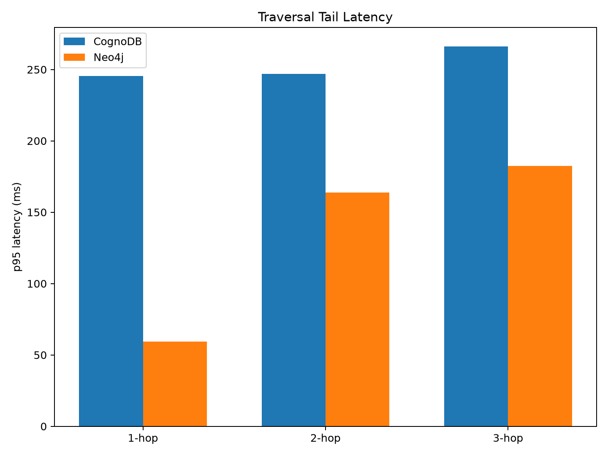
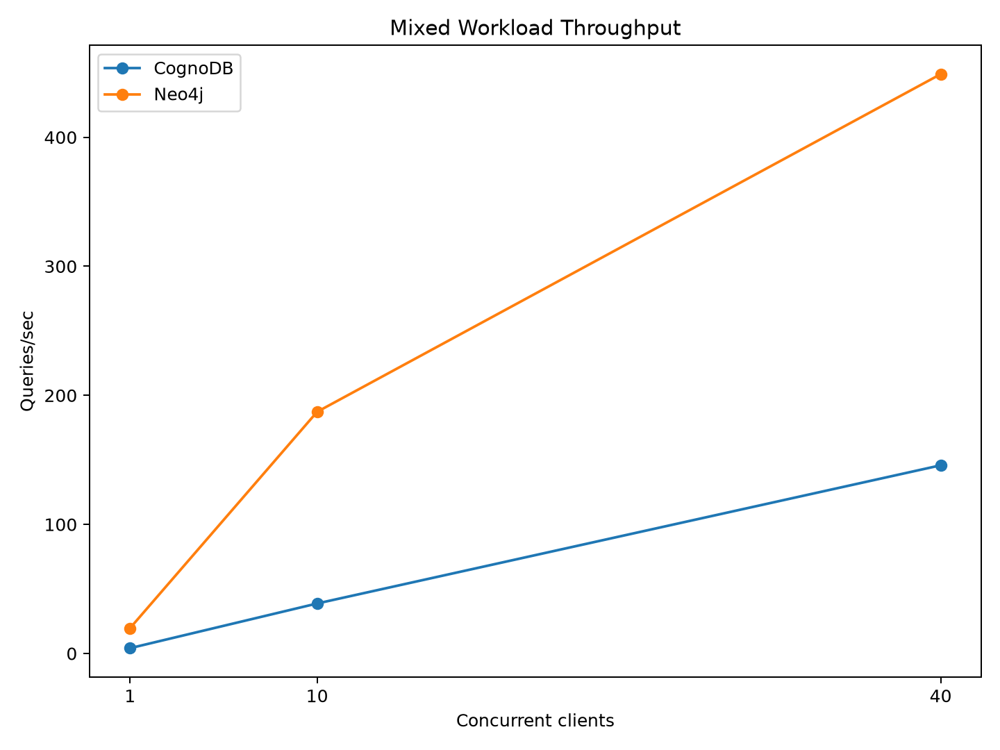

# Graph Database Cloud Benchmark

A reproducible performance benchmark comparing **CognoDB** and **Neo4j** using the same graph dataset and equivalent application-level workloads.

The benchmark evaluates:

- Graph ingestion
- Point lookups
- Filtered lookups
- 1-hop, 2-hop and 3-hop graph traversal
- Aggregation
- Mixed workloads under concurrent clients
- p50 and p95 latency
- Throughput

> **Important:** This is an observational cloud-service benchmark, not a hardware-normalized database benchmark. CognoDB was tested on its free C0 tier, while Neo4j was tested using a free Neo4j Aura instance. The exact underlying resources of the managed Neo4j instance were not exposed.

---

## Results Summary

Neo4j demonstrated lower observed latency and higher throughput across the tested workloads.

### Query Latency

| Workload | CognoDB p50 | Neo4j p50 | Neo4j Speedup |
|---|---:|---:|---:|
| 1-hop traversal | 240.88 ms | 50.44 ms | 4.78x |
| 2-hop traversal | 241.15 ms | 50.02 ms | 4.82x |
| 3-hop traversal | 241.40 ms | 50.22 ms | 4.81x |
| Point lookup | 238.65 ms | 49.88 ms | 4.78x |
| Filtered lookup | 251.44 ms | 48.96 ms | 5.14x |
| Group-by | 365.98 ms | 67.44 ms | 5.43x |

Neo4j achieved approximately **79–82% lower observed p50 latency** across the tested workloads.

### Query Latency Visualization



---

## Ingestion Performance

| Operation | CognoDB | Neo4j | Neo4j Advantage |
|---|---:|---:|---:|
| Nodes/sec | 3,104 | 7,105 | 2.29x |
| Relationships/sec | 842 | 7,712 | 9.16x |

Relationship ingestion showed the largest observed difference, with Neo4j achieving approximately **9.16x higher throughput**.

### Ingestion Throughput Visualization



---

## Traversal Tail Latency

Median latency remained relatively stable across 1–3 hops, but p95 behavior was different.

| Database | 1-hop p95 | 3-hop p95 | Increase |
|---|---:|---:|---:|
| CognoDB | 245.42 ms | 266.05 ms | +8.4% |
| Neo4j | 59.49 ms | 182.32 ms | +206.5% |

Neo4j maintained substantially lower absolute latency, but deeper traversals produced significantly higher tail-latency growth in the tested workload.

### Traversal Tail Latency Visualization



---

## Mixed Workload

The mixed workload was executed for 30 seconds at three concurrency levels.

| Concurrent Clients | CognoDB QPS | Neo4j QPS | Neo4j Advantage |
|---:|---:|---:|---:|
| 1 | 4.10 | 19.63 | 4.79x |
| 10 | 38.72 | 187.24 | 4.84x |
| 40 | 145.81 | 448.92 | 3.08x |

Both databases completed the mixed-workload tests without errors.

At 40 concurrent clients, Neo4j achieved approximately **449 QPS compared with 146 QPS for CognoDB**.

### Mixed Workload Visualization



---

# Dataset

The benchmark uses the **Pokec social-network relationship dataset**.

The raw relationship file contains:

```text
30,622,564 relationships


For the benchmark, a reproducible subset of:

74,062 nodes
150,000 relationships

was prepared.

The processed files are:

data/processed/nodes.csv
data/processed/relationships.csv
Benchmark Workloads
1. Point Lookup

Looks up a single Person node by its ID.

Purpose:

Index performance
Simple node retrieval
Basic request latency
2. Filtered Lookup

Retrieves nodes using a property filter:

group = 3

Purpose:

Property filtering
Indexed/property-based retrieval
Query latency
3. Graph Traversal

The benchmark evaluates:

1-hop
2-hop
3-hop

Purpose:

Relationship traversal
Multi-hop graph queries
Latency scaling with traversal depth
4. Aggregation

Performs a group-by style aggregation over the graph.

Purpose:

Aggregation performance
Query processing
Analytical workload behavior
5. Mixed Workload

The mixed benchmark combines different query types and executes them concurrently.

Concurrency levels:

1 client
10 clients
40 clients

Each concurrency test runs for approximately 30 seconds.

Dataset Loading
CognoDB

Node ingestion:

74,062 nodes
3,104 nodes/sec
23.86 seconds

Relationship ingestion:

150,000 relationships
842 relationships/sec
178.10 seconds

Dataset verification:

Nodes:         74,062
Relationships: 150,000
Verification:  Successful
Neo4j

Node ingestion:

74,062 nodes
7,105 nodes/sec
10.42 seconds

Relationship ingestion:

150,000 relationships
7,712 relationships/sec
19.45 seconds

Dataset verification:

Nodes:         74,062
Relationships: 150,000
Verification:  Successful
Environment

The benchmark was executed from:

Ubuntu 24.04 LTS
x86_64
8 CPUs
~7.56 GiB system memory
Python 3.12
Docker 29.7.2

The application uses the Neo4j Python driver for database connectivity.

Database Configuration
CognoDB

The benchmark used the CognoDB free C0 tier.

The managed free tier provides a small resource footprint. The benchmark therefore represents performance under a constrained free-tier deployment.

Neo4j

The benchmark used a free Neo4j Aura instance.

The instance reported:

Neo4j 5.27 Aura
Enterprise Edition

The exact CPU and memory allocation of the managed Aura instance was not exposed through the available database interfaces.

A self-hosted Neo4j comparison was also investigated, but the available local machine has approximately 7.56 GiB RAM and the attempted container configuration exceeded the available memory configuration. The self-hosted result was therefore not used in the benchmark.

Important Benchmark Limitations

This benchmark should not be interpreted as a controlled hardware-normalized database benchmark.

The primary limitations are:

Different managed infrastructure

CognoDB and Neo4j Aura use different cloud infrastructure.

Exact Neo4j Aura resources were unavailable

The exact CPU and RAM allocated to the free Aura instance could not be determined.

Free-tier limitations

Both databases were tested using free-tier resources rather than production-sized infrastructure.

Application-level loading

Ingestion throughput depends on the Python loading implementation, transaction batching, network behavior and database configuration.

Small benchmark dataset

The benchmark uses 150,000 relationships rather than the complete 30.6 million relationship dataset.

Single benchmark machine

The client-side benchmark execution originated from one Ubuntu machine.

Latency includes network effects

The managed Neo4j Aura benchmark includes network communication between the benchmark client and the cloud database.

Key Findings
Query Performance

Neo4j demonstrated approximately:

4.78x – 5.43x

lower observed p50 latency across the tested workloads.

The largest difference was observed for aggregation:

CognoDB: 365.98 ms
Neo4j:    67.44 ms
Ingestion

Neo4j showed significantly higher observed ingestion throughput:

Nodes:
2.29x higher throughput


Relationships:
9.16x higher throughput

The relationship-ingestion difference was particularly pronounced.

Because ingestion is application-dependent, this result should be interpreted as a measurement of the complete loading implementation rather than an isolated database-engine measurement.

Concurrency

Neo4j achieved higher mixed-workload throughput at every tested concurrency level.

At 40 concurrent clients:

CognoDB: 145.81 QPS
Neo4j:   448.92 QPS

Neo4j therefore achieved approximately:

3.08x

the observed throughput.

Interestingly, the relative advantage decreased as concurrency increased, suggesting that both systems experienced different scaling behavior under higher concurrent load.

Traversal Behavior

Neo4j had dramatically lower absolute traversal latency.

However, its p95 latency increased significantly with traversal depth:

1-hop p95 → 59.49 ms
3-hop p95 → 182.32 ms

This represents a:

206.5%

increase.

CognoDB showed a smaller relative increase:

245.42 ms → 266.05 ms
8.4%

Therefore, while Neo4j was considerably faster in absolute terms, the deeper traversal workload produced greater tail-latency variability.

Overall Conclusion

Based on the workloads and configurations tested, Neo4j demonstrated substantially better observed performance than CognoDB.

Neo4j provided:

Lower query latency
Higher ingestion throughput
Higher mixed-workload throughput
Strong point-lookup performance
Strong graph traversal performance

CognoDB nevertheless demonstrated successful operation with a very small resource footprint and completed the complete benchmark workload without errors.

The results should therefore be interpreted as:

Neo4j delivered better observed performance in this benchmark, while CognoDB provided a lightweight, resource-constrained graph database deployment.

A production database selection would require additional evaluation of:

Cost
Memory requirements
Scaling model
Query complexity
Operational requirements
Availability
Backup/recovery
Dataset size
Production workload characteristics
Reproducing the Benchmark

Clone the repository and create a Python environment:

git clone git@github.com:sanjay786cell/graph-db-cloud-benchmark.git
cd graph-db-cloud-benchmark


python3 -m venv .venv
source .venv/bin/activate


pip install -r requirements.txt

Configure credentials in .env.

Never commit .env to Git.

Prepare the Dataset
python scripts/prepare_dataset.py

Verify:

python scripts/verify_cognodb.py
Run CognoDB Benchmarks

Run the database loading process and then:

python benchmark/traversal_benchmark.py
python benchmark/lookup_benchmark.py
python benchmark/filtered_lookup_benchmark.py
python benchmark/aggregation_benchmark.py
python benchmark/mixed_workload.py
Run Neo4j Benchmarks

Configure the Neo4j connection in .env.

Setup:

python scripts/setup_neo4j.py

Load nodes:

python scripts/load_neo4j.py

Load relationships:

python scripts/load_neo4j_relationships.py

Verify:

python scripts/verify_neo4j.py

Run:

python benchmark/traversal_benchmark_neo4j.py
python benchmark/lookup_benchmark_neo4j.py
python benchmark/filtered_lookup_benchmark_neo4j.py
python benchmark/aggregation_benchmark_neo4j.py
python benchmark/mixed_workload_neo4j.py
Result Files

Benchmark results are stored under:

results/

Current result files include:

cognodb_results.csv
neo4j_results.csv
neo4j_mixed_workload.csv

Comparison utilities:

python benchmark/compare_results.py
python benchmark/analyze_results.py
python benchmark/traversal_analysis.py
Project Structure
graph-db-benchmark/
│
├── benchmark/
│   ├── aggregation_benchmark.py
│   ├── aggregation_benchmark_neo4j.py
│   ├── analyze_results.py
│   ├── compare_results.py
│   ├── filtered_lookup_benchmark.py
│   ├── filtered_lookup_benchmark_neo4j.py
│   ├── lookup_benchmark.py
│   ├── lookup_benchmark_neo4j.py
│   ├── mixed_workload.py
│   ├── mixed_workload_neo4j.py
│   ├── traversal_analysis.py
│   ├── traversal_benchmark.py
│   └── traversal_benchmark_neo4j.py
│
├── scripts/
│   ├── prepare_dataset.py
│   ├── setup_schema.py
│   ├── setup_neo4j.py
│   ├── load_cognodb.py
│   ├── load_neo4j.py
│   ├── load_neo4j_relationships.py
│   ├── verify_cognodb.py
│   └── verify_neo4j.py
│
├── results/
│   ├── cognodb_results.csv
│   ├── neo4j_results.csv
│   └── neo4j_mixed_workload.csv
│
├── archive/
│   └── Earlier experimental scripts
│
├── .env.example
├── .gitignore
└── README.md
License

This repository contains benchmark code and analysis created for evaluating graph database performance.

The Pokec dataset is not included in this repository. Users should obtain the dataset separately according to its applicable terms.


